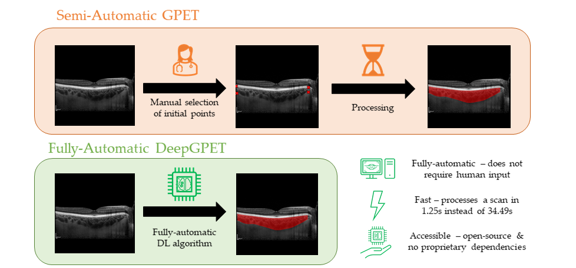

# DeepGPET: fully automated choroid region segmentation in OCT

## DeepGPET

DeepGPET is a fully automatic, deep learning based method for choroid region segmentation in optical coherence tomography (OCT) scans. This algorithm can be used to segment the choroid region, and then subsequently measure clinically relevant metrics such as choroid thickness, area and volume. The method was trained on labels from a previously published, semi-automatic algorithm GPET.



The description of the model can be found [here](https://tvst.arvojournals.org/article.aspx?articleid=2778573). The paper for this methodology has been published in Translations Vision Science & Technology, Association for Research and Vision in Ophthalmology (ARVO).

---

### Project Stucture

```
.
├── choseg/         # core module for carrying out choroid region segmentation and derived regional measurements
├── notebooks/		# Jupyter notebooks which stores example data and a demo of the pixel GUI to select the fovea.
├── .gitignore
├── README.md
├── LICENSE
└── install.txt		# Anaconda prompt commands for building conda environment with core packages
```

- The code found in `choseg`
```
.
├── choseg/                             
├───── metrics/         # Code to calculate downstream regional measures such choroid thickness, area and (subregional) volume
├───── __init__.py
├───── inference.py     # Inference classes for segmenting
└───── utils.py         # Helper functions for plotting and processing segmentations.
```

- The code found in `choseg/metrics`
```
.
├── metrics/
├───── __init__.py                          
├───── choroid_metrics.py   # Code to calculate choroid measurements such choroid thickness, area and (subregional) volume
├───── choroid_utils.py     # Utility functions for measuring the choroid
└───── pixel_gui.py         # OpenCV-based implementation of a simple GUI to select pixels manually.
```

---

## Getting Started

To get a local copy up and running follow these steps.

1. Clone the DeepGPET repository via `git clone https://github.com/jaburke166/deepgpet.git`.

2. You will need a local installation of python to run DeepGPET. We recommend a lightweight package management system such as Miniconda. Follow the instructions [here](https://docs.anaconda.com/free/miniconda/miniconda-install/) to download Miniconda for your desired operating system.

3. After downloading, navigate and open the Anaconda Prompt, and copy each line found in `install.txt` to create your own environment in Miniconda and download necessary packages.
    - Note if you have a GPU running locally to use DeepGPET, line 2 in `install.txt` should be `pip3 install torch torchvision --index-url https://download.pytorch.org/whl/cu121`
  
4. Copy the `conda.pth` file into your python environments `site-packages` directory, commonly found at `path\to\miniconda3\envs\choroid-analysis\Lib\site-packages`
    - Change the file paths in `conda.pth` the absolute file paths that link to the DeepGPET Github repository.
    - This means your conda environment `choroid-analysis` now has access to the files in the DeepGPET.
    - Importantly, you can now use `import choves, choseg` in any notebook or python script which uses this conda environment.
  
6. Activate your new environment using `conda activate choroid-analysis` on an Anaconda Prompt terminal.
 
6. Launch notebooks using `jupyter notebook` or jupyter labs using `jupyter lab` and see the minimal example below so that you can analyse your own choroids!

Done! You have successfully set up the software to analyse the choroid in OCT B-scans!

If you have any problems using this method, please do not hesitate to contact us!

### Minimal example

```
from choseg import inference, utils
from choseg.metrics import choroid_metrics

# Load model, default threshold of 0.5
deepgpet = inference.DeepGPET()

# Load image
img_path = r"notebooks\example_data\image1.png" #"path\to\img"
img = utils.load_img(img_path)

# Segment
img_seg = deepgpet(img)
img_seg_cmap = utils.generate_imgmask(img_seg,0.5,0) # Creates an RGBA colourmap to overlay segmentation onto image
img_trace = utils.get_trace(img_seg,0.5) # Detects the upper and lower choroid boundaries based on the mask
utils.plot_img(img, img_trace, cmap=img_seg_cmap, sidebyside=True) # Plots the image, trace and segmentation colour map

# Measure choroid thickness and area at default 3mm region of interest
choroid_metrics.compute_choroid_measurement(img_seg)
# thickness (temporal, subfoveal, nasal) (190, 290, 130), choroid area 1.374898mm2
```

Please refer to `usage.ipynb` for a more in depth description of segmenting the choroid using DeepGPET, and measuring choroid thickness and area.

---
## Contributors and Citing

The contributors to this method and codebase are:

* Jamie Burke (Jamie.Burke@ed.ac.uk)
* Justin Engelmann (Justin.Engelmann@ed.ac.uk)

If you wish to use this methodology please consider citing our work using the following BibText

```
@article{burke2023open,
  title={An Open-Source Deep Learning Algorithm for Efficient and Fully Automatic Analysis of the Choroid in Optical Coherence Tomography},
  author={Burke, Jamie and Engelmann, Justin and Hamid, Charlene and Reid-Schachter, Megan and Pearson, Tom and Pugh, Dan and Dhaun, Neeraj and Storkey, Amos and King, Stuart and MacGillivray, Tom J and others},
  journal={Translational Vision Science \& Technology},
  volume={12},
  number={11},
  pages={27--27},
  year={2023},
  publisher={The Association for Research in Vision and Ophthalmology}
}
  ```

 
 
 
 
 
 
 
 
